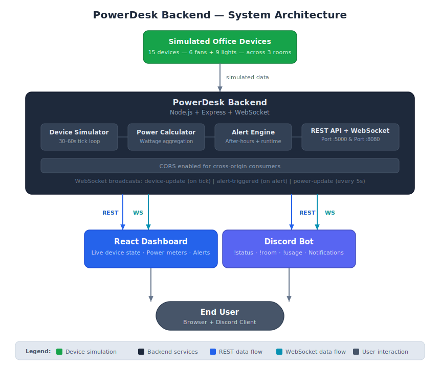

# PowerDesk Backend

Real-time office device simulator backend with REST API + WebSocket broadcasting.

- 📖 [Integration Contract](INTEGRATION.md) — full API docs for consumers (Dashboard, Discord Bot)
- 📊 [System Architecture](docs/system-diagram.svg) — component diagram

---

## Prerequisites

- Node.js 18+ (uses `node --test` runner, `fetch` global)
- npm

## Quick Start

```bash
# 1. Install dependencies
npm install

# 2. Copy environment config and adjust if needed
cp .env.example .env

# 3. Start the server
npm start
```

The server starts on **http://localhost:5000** and WebSocket on **ws://localhost:8080**.

Verify it's running:

```bash
curl http://localhost:5000/api/status
```

Expected response:

```json
{
  "success": true,
  "data": {
    "status": "healthy",
    "backend": { "uptime": 5, "version": "1.0.0" },
    "simulator": { "running": true, "devicesTracked": 15, "lastUpdate": "..." }
  },
  "timestamp": "...",
  "error": null
}
```

## Development

```bash
npm run dev      # starts with nodemon (auto-restart on changes)
```

## Testing

```bash
npm test         # runs all 50+ tests with Node built-in runner
```

Tests include unit tests (simulator, power calculator, alert engine) and integration tests (all REST endpoints, WebSocket).

---

## API Endpoints

All responses use the standard envelope (see [INTEGRATION.md](INTEGRATION.md) for full schemas).

### GET /api/status

Health check with live simulator metadata.

```bash
curl http://localhost:5000/api/status
```

### GET /api/devices

All 15 devices nested by room (drawing-room, work-room-1, work-room-2).

```bash
curl http://localhost:5000/api/devices
```

### GET /api/devices/:room

Devices in a specific room.

```bash
curl http://localhost:5000/api/devices/drawing-room
curl http://localhost:5000/api/devices/work-room-1
curl http://localhost:5000/api/devices/not-a-room     # returns 404 ROOM_NOT_FOUND
```

### GET /api/power

Full power consumption payload (total, by-room breakdown, fan/light breakdown, daily kWh estimate).

```bash
curl http://localhost:5000/api/power
```

### GET /api/power/summary

Lean power summary for the Discord bot.

```bash
curl http://localhost:5000/api/power/summary
```

### GET /api/alerts

Queryable alert feed.

```bash
curl http://localhost:5000/api/alerts
curl "http://localhost:5000/api/alerts?since=2026-07-03T20:00:00.000Z"   # since timestamp
curl "http://localhost:5000/api/alerts?limit=5"                           # last 5 alerts
curl "http://localhost:5000/api/alerts?since=invalid"                     # returns 400
```

---

## WebSocket Testing

Connect to `ws://localhost:8080` to receive live events.

```bash
node -e "
const WebSocket = require('ws');
const ws = new WebSocket('ws://localhost:8080');
ws.on('message', (data) => console.log(JSON.parse(data.toString())));
ws.on('open', () => console.log('Connected'));
"
```

This logs every `device-update`, `alert-triggered`, and `power-update` event as they happen.

---

## Configuration

Copy `.env.example` to `.env` and edit to override defaults:

| Variable | Default | Description |
|---|---|---|
| `PORT` | `5000` | HTTP server port |
| `WS_PORT` | `8080` | WebSocket server port |
| `HOST` | `localhost` | Bind address |
| `OFFICE_START_HOUR` | `9` | Office hours start (24h) |
| `OFFICE_END_HOUR` | `17` | Office hours end (24h) |
| `SIMULATOR_INTERVAL_MIN` | `30000` | Min tick interval (ms) |
| `SIMULATOR_INTERVAL_MAX` | `60000` | Max tick interval (ms) |
| `ENABLE_AFTER_HOURS_ALERTS` | `true` | Toggle after-hours alert detection |
| `ENABLE_RUNTIME_ALERTS` | `true` | Toggle continuous-runtime alert detection |
| `CONTINUOUS_RUNTIME_THRESHOLD_HOURS` | `2` | Hours before runtime alert triggers |

---

## System Diagram



---

## Verification Checklist

Use these steps to confirm the backend is fully functional before wiring up the React Dashboard and Discord Bot.

### 1. REST API Health

```bash
curl http://localhost:5000/api/status | jq .data.status
# → "healthy"
```

### 2. Device Count

```bash
curl http://localhost:5000/api/devices | jq '.data | length'
# → 3  (drawing-room, work-room-1, work-room-2)

curl http://localhost:5000/api/devices | jq '[.data[] | length] | add'
# → 15 (total devices across all rooms)
```

### 3. Power Consistency

```bash
# totalPower should equal sum of byRoom power values
curl http://localhost:5000/api/power | jq '.data.totalPower'
curl http://localhost:5000/api/power | jq '[.data.byRoom[] | .power] | add'
# → both return the same number
```

### 4. Alerts Feed

```bash
curl http://localhost:5000/api/alerts | jq '.data.alerts | length'
# → 0 or more (depending on simulation state)
```

### 5. WebSocket Events

Run the WebSocket test snippet above. After connecting, you should see:
- `power-update` messages every ~5 seconds
- `device-update` messages when the simulator ticks (every 30–60s)
- `alert-triggered` messages if alert conditions are met

### 6. End-to-End Flow (Dashboard + Bot)

Once the React Dashboard and Discord Bot are running:

1. **Dashboard** opens and renders 15 devices across 3 rooms
2. Device statuses change every 30–60 seconds without page refresh
3. Power meter shows live `totalPower` updating every 5 seconds
4. Discord bot responds to `!status` with device summary
5. Discord bot responds to `!usage` with power data
6. Discord bot responds to `!room <room>` with per-room device states
7. If an alert triggers, the Discord bot receives and posts it within 5 seconds

---

## Deployment

### Railway

```bash
# Install Railway CLI or use GitHub integration
railway login
railway init
railway up

# Set environment variables in Railway dashboard:
# PORT, WS_PORT, HOST, OFFICE_START_HOUR, OFFICE_END_HOUR, etc.
```

### Render

1. Push repo to GitHub
2. In Render Dashboard → New Web Service → connect repo
3. Build command: `npm install`
4. Start command: `npm start`
5. Add environment variables in Render dashboard

Both platforms will provide a public URL. Set `CORS_ORIGIN` if needed, or leave CORS open for development.

---

## Project Structure

```
src/
├── index.js              # Entry point, Express + WebSocket setup
├── simulator.js          # Device state & simulation engine
├── powerCalculator.js    # Power consumption logic
├── alertEngine.js        # Alert detection & publishing
├── websocket.js          # WebSocket broadcasting
├── config.js             # Environment configuration
├── routes/
│   ├── status.js         # GET /api/status
│   ├── devices.js        # GET /api/devices, /api/devices/:room
│   ├── power.js          # GET /api/power, /api/power/summary
│   └── alerts.js         # GET /api/alerts
├── middleware/
│   ├── errorHandler.js   # Global error handler
│   ├── validation.js     # Request validation helpers
│   └── requestLogger.js  # 4xx/5xx logging
└── utils/
    ├── logger.js         # Console logging wrapper
    ├── response.js       # Standard envelope helpers
    ├── constants.js      # Rooms, power wattages
    └── timings.js        # After-hours & runtime helpers
test/                     # 10 test files, 50+ tests
docs/
└── system-diagram.svg    # Architecture diagram
```
