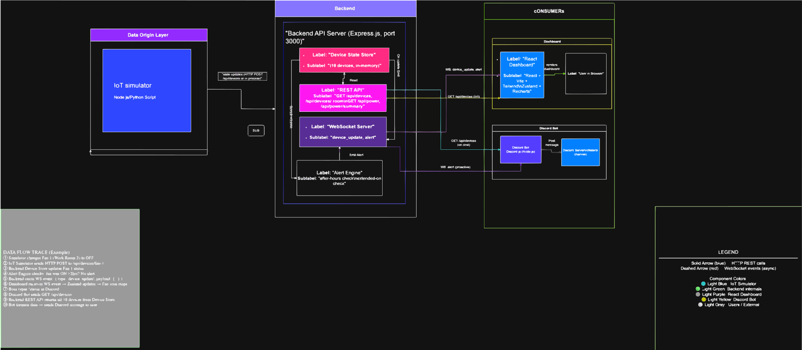
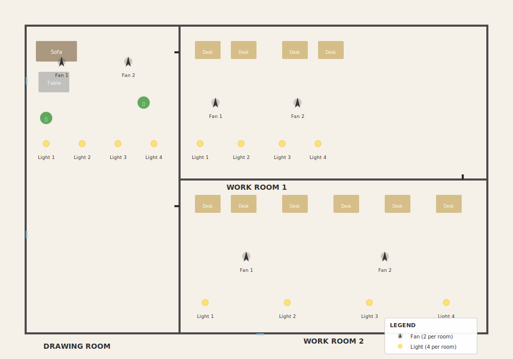

# PowerDesk

Real-time office device monitoring dashboard with a Discord bot for instant queries. Simulates 15 devices (fans and lights) across 3 rooms, broadcasting live state changes, power consumption, and alerts through a REST API, WebSocket, and Discord integration.

---

## Team
**Team CLI** — Techathon Nationals & Rover Summit Hackathon '26
| Name | GitHub | Email |
|------|--------|-------|
| MD. Sadman Saif | [@HyperZx2O](https://github.com/HyperZx2O) | sadman.zarifsaif@gmail.com |
| Afra Tasfia | [@afraNoOneAT](https://github.com/afraNoOneAT) | afra.tasfia@gmail.com |
| Montaha Zaman | [@yvonnieeez](https://github.com/yvonnieeez/) | montahazaman2006@gmail.com |
| Toshrif Alam | [@Tosh25xyz](https://github.com/Tosh25xyz) | toshrif1986@gmail.com |

---

## Live Deployment

| Component | URL |
|-----------|-----|
| Dashboard | [power-desk.vercel.app](https://power-desk.vercel.app/) |
| Backend API | [powerdesk-api.onrender.com](https://powerdesk-api.onrender.com/) |
| Discord Bot | [powerdesk-bot.onrender.com](https://powerdesk-bot.onrender.com/) |

---

## Architecture





### Hardware Schematic

The physical circuit was designed in Tinkercad and represents one room's device setup (5 devices: 2 fans + 3 lights). The Arduino UNO substitutes for ESP32 due to Tinkercad's component limits.


**Key components:**
- **Arduino UNO** — Microcontroller (digital I/O, ADC) controlling device states
- **Relay + Transistor assemblies** — Transistor drives the relay coil; relay switches device power on/off
- **Potentiometers** — Simulate ACS712 current sensor readings (Tinkercad lacks a native current-sensor component)
- **Light bulbs** — Represent the 5 simulated devices per room

---

## Tech Stack

| Component | Technologies |
|-----------|-------------|
| **Backend** | Node.js, Express 5, WebSocket (`ws`), Zod validation |
| **Dashboard** | React 19, Vite, TypeScript, Tailwind CSS v4, Zustand, Recharts, Framer Motion |
| **Discord Bot** | discord.js v14, TypeScript, Axios, Zod, Pino logging |
| **Infrastructure** | Vercel (dashboard), Render (backend + bot), UptimeRobot (keep-alive) |

---

## Project Structure

```
powerdesk/
├── src/                        # Backend (CommonJS) + Dashboard (TypeScript/ESM)
│   ├── index.js                # Express + WebSocket entry point
│   ├── simulator.js            # Device state simulation engine
│   ├── powerCalculator.js      # Power consumption calculations
│   ├── alertEngine.js          # Alert detection (after-hours, continuous runtime)
│   ├── websocket.js            # WebSocket broadcasting
│   ├── config.js               # Environment configuration
│   ├── routes/                 # REST API routes
│   ├── middleware/              # Express middleware
│   ├── components/             # React UI components
│   ├── store/                  # Zustand state management
│   ├── types/                  # TypeScript types + Zod schemas
│   └── utils/                  # Shared utilities
├── discord-bot/                # Discord bot (TypeScript, ESM)
│   └── src/
│       ├── index.ts            # Bot entry point
│       ├── commands/           # Slash + prefix command handlers
│       ├── formatters/         # Response formatting
│       ├── api/                # Backend API client
│       ├── ws/                 # WebSocket alert listener
│       └── llm/                # Groq LLM humanization
├── test/                       # Backend tests (57 tests)
├── docs/                       # Diagrams and specs
└── context/                    # Design specifications
```

---

## Getting Started

### Prerequisites

- Node.js 18+ (uses `node --test` runner and global `fetch`)
- npm

### Backend

```bash
# Install dependencies
npm install

# Configure environment
cp .env.example .env

# Start the server (REST on :5000, WebSocket on :5000)
npm start

# Development with auto-restart
npm run dev
```

Verify it's running:

```bash
curl http://localhost:5000/api/status
```

### Dashboard

```bash
# The dashboard shares the root package.json
# Set the backend URL for local development
echo "VITE_BACKEND_URL=http://localhost:5000" > .env
echo "VITE_WS_URL=ws://localhost:5000" >> .env

# Start the dev server
npx vite

# Production build
npm run build
```

### Discord Bot

```bash
cd discord-bot

# Install dependencies
npm install

# Configure environment
cp .env.example .env
# Edit .env with your Discord token, backend URL, etc.

# Register slash commands (one-time)
npm run register

# Start the bot
npm start

# Development with auto-restart
npm run dev
```

---

## API Reference

All responses use a standard envelope:

```json
{
  "success": true,
  "data": { "..." },
  "timestamp": "2026-07-04T10:00:00.000Z",
  "error": null
}
```

### Endpoints

| Method | Endpoint | Description |
|--------|----------|-------------|
| `GET` | `/api/status` | Health check with simulator metadata |
| `GET` | `/api/devices` | All 15 devices nested by room |
| `GET` | `/api/devices/:room` | Devices in a specific room |
| `GET` | `/api/power` | Full power consumption payload |
| `GET` | `/api/power/summary` | Bot-friendly power summary |
| `GET` | `/api/alerts` | Queryable alert feed |

### WebSocket Events

Connect to the same port as the REST API. No auth required.

| Event | Trigger | Payload |
|-------|---------|---------|
| `device-update` | Simulator flips a device (every 30-60s) | Device object with new status |
| `alert-triggered` | Alert condition met | Alert object with severity and message |
| `power-update` | Fixed 5-second interval | Total power + per-room breakdown |

Full API documentation: [INTEGRATION.md](INTEGRATION.md)

---

## Discord Bot Commands

| Command | Description |
|---------|-------------|
| `/status` or `!status` | Show on/off state of all office devices |
| `/room name:<room>` or `!room <room>` | Show devices for a specific room |
| `/usage` or `!usage` | Show current power usage and daily estimate |

**Valid room names:** `drawing`, `work1`, `work2`

**LLM Humanization:** When `GROQ_API_KEY` is set, responses are rephrased by an LLM for a conversational tone. Falls back to template formatters on failure.

---

## Configuration

### Backend Environment Variables

| Variable | Default | Description |
|----------|---------|-------------|
| `PORT` | `5000` | HTTP server port |
| `HOST` | `localhost` | Bind address |
| `OFFICE_START_HOUR` | `9` | Office hours start (24h) |
| `OFFICE_END_HOUR` | `17` | Office hours end (24h) |
| `SIMULATOR_INTERVAL_MIN` | `30000` | Min tick interval (ms) |
| `SIMULATOR_INTERVAL_MAX` | `60000` | Max tick interval (ms) |
| `ENABLE_AFTER_HOURS_ALERTS` | `true` | Toggle after-hours alert detection |
| `ENABLE_RUNTIME_ALERTS` | `true` | Toggle continuous-runtime alert detection |
| `CONTINUOUS_RUNTIME_THRESHOLD_HOURS` | `2` | Hours before runtime alert triggers |

### Discord Bot Environment Variables

| Variable | Required | Description |
|----------|----------|-------------|
| `DISCORD_TOKEN` | Yes | Bot token from Discord Developer Portal |
| `CLIENT_ID` | Yes | Bot application client ID |
| `GUILD_ID` | Yes | Discord server ID |
| `ALERT_CHANNEL_ID` | Yes | Channel for proactive alerts |
| `BACKEND_BASE_URL` | Yes | Backend REST URL |
| `BACKEND_WS_URL` | Yes | Backend WebSocket URL |
| `GROQ_API_KEY` | No | Groq API key for LLM humanization |
| `GROQ_MODEL` | No | LLM model (default: `llama-3.3-70b-versatile`) |

---

## Testing

### Backend

```bash
npm test    # 57 tests across 10 files
```

Covers: simulator, power calculator, alert engine, all REST endpoints, WebSocket server, validation, request logging.

### Discord Bot

```bash
cd discord-bot && npm test    # 55 tests across 6 files
```

Covers: config validation, command routing, formatters, error handling, LLM humanization, logging.

---

## Deployment

The project is deployed on three platforms:

| Platform | Service | Purpose |
|----------|---------|---------|
| **Vercel** | Dashboard | Static SPA hosting with automatic deployments |
| **Render** | Backend API | Node.js server for REST + WebSocket |
| **Render** | Discord Bot | Long-running bot process with health check |
| **UptimeRobot** | Keep-alive | Pings both Render services every 5 minutes |

### Deploy Your Own

1. **Fork the repository** on GitHub
2. **Backend:** Create a Render Web Service from the repo
   - Build: `npm install`
   - Start: `node src/index.js`
   - Set environment variables in Render dashboard
3. **Bot:** Create a second Render Web Service
   - Root Directory: `discord-bot`
   - Build: `npm install`
   - Start: `npm start`
   - Set environment variables
4. **Dashboard:** Import into Vercel
   - Set `VITE_BACKEND_URL` and `VITE_WS_URL` as build-time env vars
5. **UptimeRobot:** Add HTTP monitors for both Render service URLs

---

## Data Model

15 simulated devices across 3 rooms:

| Room | Fans | Lights | Total |
|------|------|--------|-------|
| Drawing Room | 2 | 3 | 5 |
| Work Room 1 | 2 | 3 | 5 |
| Work Room 2 | 2 | 3 | 5 |

Power consumption: **60W** per fan, **15W** per light. The simulator flips 1-2 devices every 30-60 seconds.

---

## License

ISC
